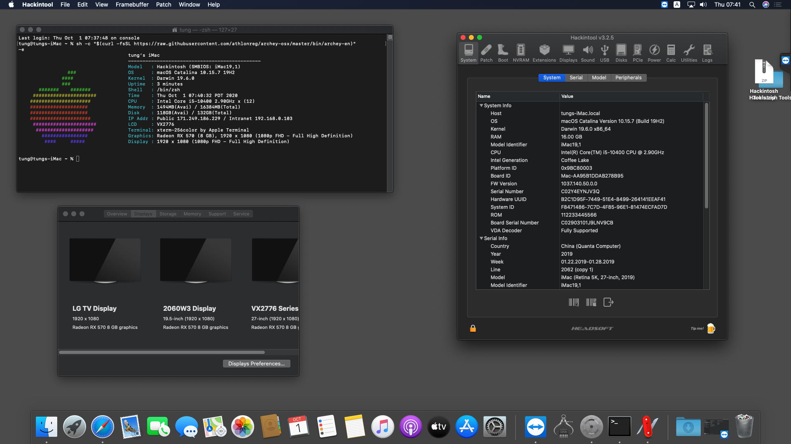
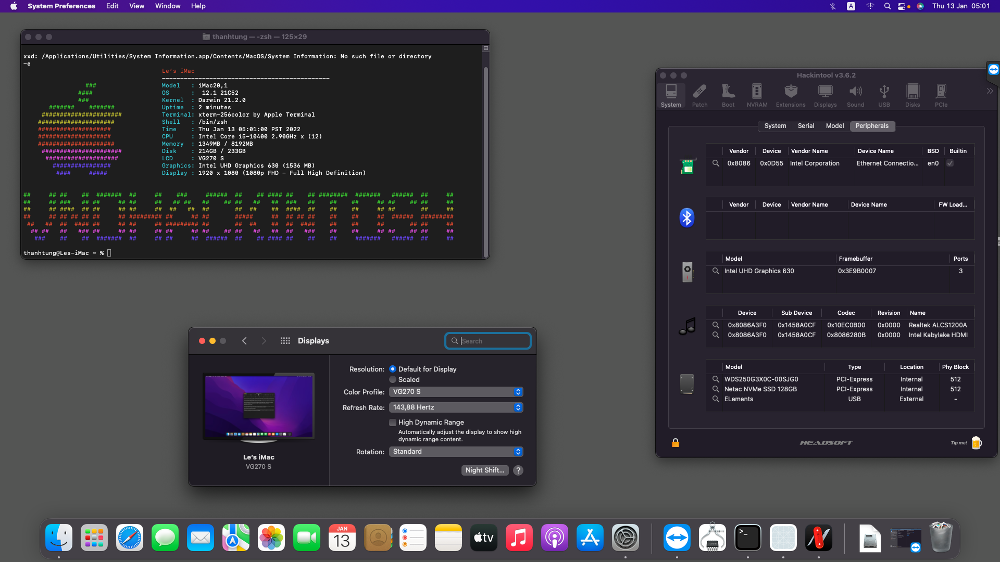
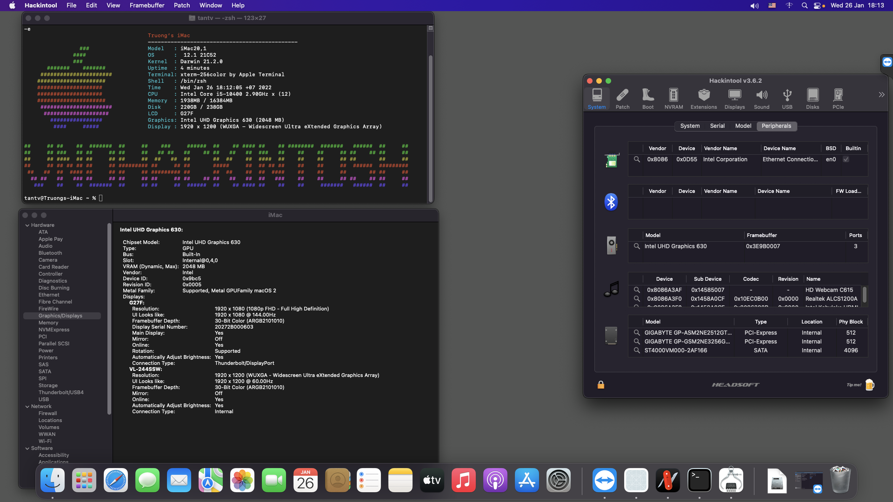

# Gigabyte B460M Aorus Pro Hackintosh

EFI for Gigabyte B460M Aorus Pro with OpenCore bootloader

## Computer Spec:

| Component        | Brank                              |
| ---------------- | ---------------------------------- |
| CPU              | Intel i3/i5/i7 10th Gen            |
| iGPU             | Intel® UHD Graphics UHD630         |
| dGPU             | AMD Polaris or above (optional)    |
| Ram              | DDR4 8 GB or more                  |
| Lan              | Intel I219                         |
| Audio            | Realtek ALCS1220A                  |
| Wifi + Bluetooth | BCM94360 + adapter pcie (optional) |
| NVMe SSD         | WDC Black SN750                    |
| NVMe SSD         | SAMSUNG 970 EVO PLUS               |
| SATA SSD         | SAMSUNG 860 EVO                    |

## What works and What doesn't or WIP:

- [x] Intel UHD 630 iGPU HDMI/DP Output
- [x] Intel UHD 630 iGPU - H264 & HEVC
- [x] Intel UHD 630 iGPU dual monitor at boot
- [x] AMD GPU HDMI/DP OUTPUT (with audio) 
- [x] AMD GPU - H264 & HEVC
- [x] ALCS1220A audio
- [x] All USB Ports (limit 15 ports)
- [x] SpeedStep / Sleep / Wake
- [x] Wi-Fi and Bluetooth 
- [x] All Sensors (CPU, GPU, NVME, SATA, FANS)
- [x] Intel I219 LAN
- [x] NVRAM
- [x] Support macOS Catalina,  Big Sur, Monterey and Ventura

## Install
### MacOS bootable USB creation:

You should choose offline installer
- Online Reccovery: [Guide Dortania](https://dortania.github.io/OpenCore-Install-Guide/installer-guide/)
- **Offline install**: [Olarila](https://www.olarila.com/topic/20908-guide-easy-fast-and-perfect-hackintosh-vanilla-step-by-step-clover-and-opencore-bootloader/) 

### USB Mapping
If you have some usb ports not working with my default **USBPorts.kext**, you should use [USBToolBox](https://github.com/USBToolBox/tool) for map usb on Windows then replace my kext.

### Choose config
Choose 1 of 3 configs in EFI/OC then rename it to **Config.plist**:
| Config                                    | Hardware                                                                                               |
|-------------------------------------------|--------------------------------------------------------------------------------------------------------|
| Config_iMac20,1_iGPU_only.plist (Default) | Use only iGPU for display output                                                                       |
| Config_iMac20,1_iGPU_headless.plist       | Use iGPU for Intel QuickSync with AMD GPU or NVIDIA Kelper GPU                                         |
| Config_iMac20,1_iGPU_headless-Navi.plist       | Use iGPU for Intel QuickSync with AMD Navi GPU (RX 5xxx, RX 6xxx)|
| Config_iMacPro1,1_AMD_GPU.plist           | Use only AMD Polaris (RX 4xx, RX 5xx) for hardware decoding, iGPU off or not available (Intel CPU with F-tail) |
| Config_iMacPro1,1_AMD_GPU-Navi.plist           | Use only AMD Navi (RX 5xxx, RX 6xxx) or above for hardware decoding, iGPU off or not available (Intel CPU with F-tail) |

### SMBIOS
SMBIOS Infos need to be change with [OCAT](https://github.com/ic005k/QtOpenCoreConfig) on Windows or [OpenCore Configurator](https://mackie100projects.altervista.org/opencore-configurator/) on macOS.

## Credits

- [Apple](https://apple.com) for macOS.
- [Acidanthera](https://github.com/acidanthera) for OpenCore and all the lovely hackintosh work.
- [Olarila](https://www.olarila.com/) For great guides and offline installer.
- [Dortania](https://dortania.github.io/OpenCore-Install-Guide) For great and detailed guides.
- [VNOHackintosh](https://facebook.com/VNOHackintosh) Support group for installation and post installation.
